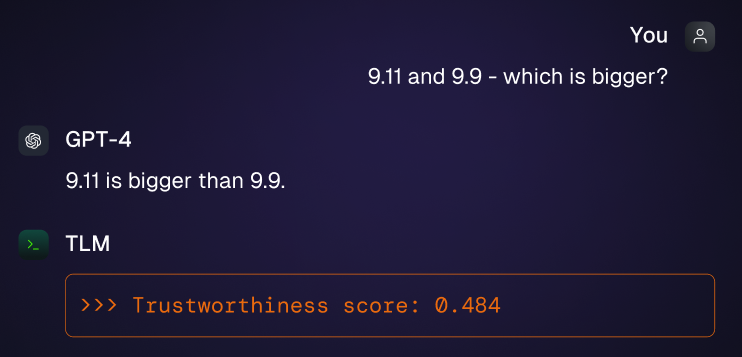

# Trustworthy Language Model (TLM)

Even today's best Large Language Models (LLMs) still occasionally hallucinate incorrect answers that can undermine your business.
To help you achieve reliable AI, Cleanlab’s Trustworthy Language Model scores the trustworthiness of responses from _any_ LLM in real-time. This lets you know which LLM outputs are reliably correct and which ones need extra scrutiny.

Get started using the TLM API via our [quickstart tutorial](tutorials/quickstart/index.ipynb).

## Key Features

- **Trustworthiness Scores**: TLM provides [state-of-the-art](https://towardsdatascience.com/benchmarking-hallucination-detection-methods-in-rag-6a03c555f063) trustworthiness scores for _any_ LLM application. You can [score](tutorials/quickstart/index.ipynb#scoring-the-trustworthiness-of-a-given-response) responses from your existing model (works for _any_ LLM) or even those written by humans.
- **Improved LLM Responses**: You can alternatively use TLM in place of your own LLM to [produce higher accuracy outputs](tutorials/tlm_advanced/index.ipynb#quality-presets) (along with trustworthiness scores). TLM can [outperform every frontier model](https://cleanlab.ai/blog/trustworthy-language-model/), because it's built on top of these models, refining their generation process via trustworthiness scoring.
- **Scalable Real-Time API**: Compatible with any LLM service and with large datasets, TLM is suitable for most enterprise applications and offers flexible configurations to control costs/latency, as well as [private deployment options](https://cleanlab.ai/sales/).
- **Add reliability to every LLM application**: TLM effectively detects incorrect responses in _any_ LLM application, including: RAG, Agents, Chatbots, Summarization, Data Extraction, Structured Outputs, Tool Calls, Classification, Data Labeling, LLM Evals, ...

## Key Advantages

- **State-of-the-art precision.** [Benchmarks](https://cleanlab.ai/blog/trustworthy-language-model/) reveal that TLM can reduce the rate of incorrect responses: of GPT-4o by 27%, of o1 by 20%, of Claude 3.5 Sonnet by 20%, and of many more recent LLMs too. In RAG applications, TLM detects incorrect answers with 3x greater precision than other [hallucination detectors](https://towardsdatascience.com/benchmarking-hallucination-detection-methods-in-rag-6a03c555f063) and [real-time Evaluation models](https://arxiv.org/abs/2503.21157).
- **Works out of the box.** TLM does **not** need to be trained on your data, which means you don't need to do _any_ dataset preparation/labeling work, nor worry about data drift or whether your AI task will evolve over time.
- **Flexibility not complexity.** Easily adjust TLM's latency/costs to meet the needs of any use-case. Or contact us and we'll do it for you!

- **Future-proof solution.** TLM is compatible with _any_ LLM model (including reasoning models), and by design will remain applicable for all future frontier models (including Agentic frameworks). Whenever a major LLM provider releases a better/faster/cheaper model, TLM will improve by relying on this as its base model.

Start using TLM in under a minute via our [quickstart tutorial](tutorials/quickstart/index.ipynb).
